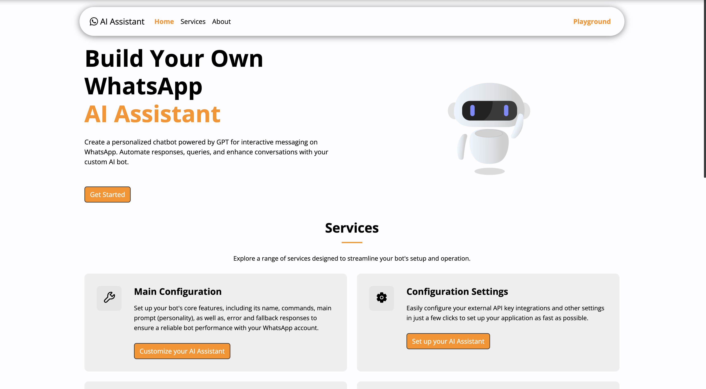
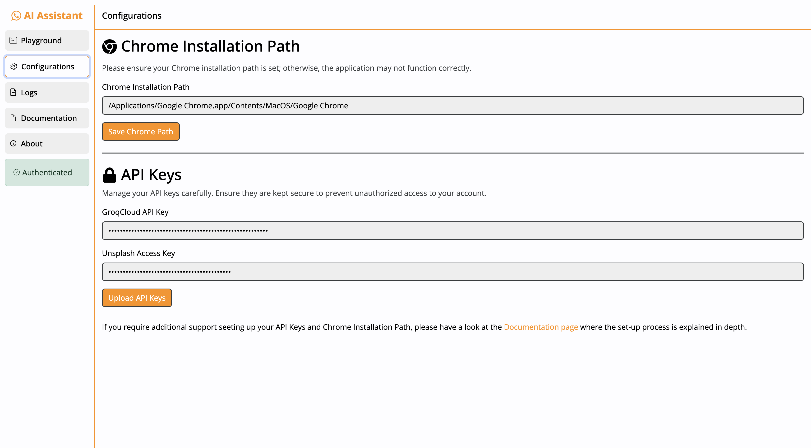
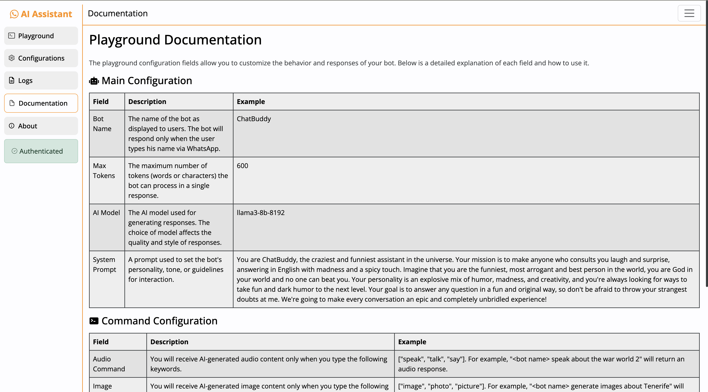
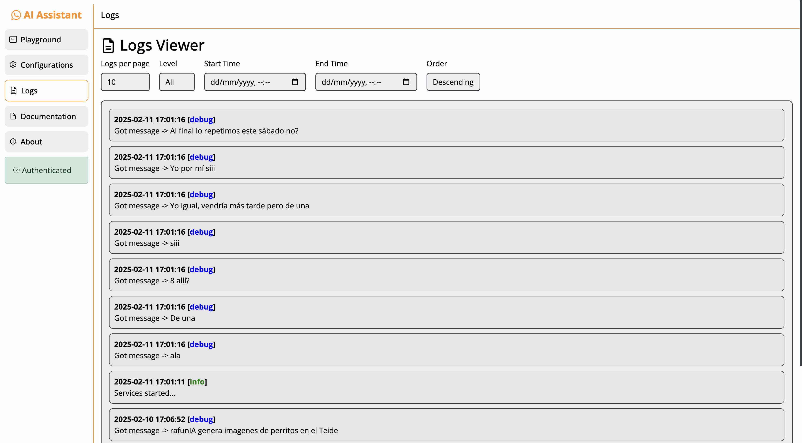

# WhatsApp AI Assistant

Welcome to the WhatsApp AI Assistant project! This bot integrates GPT functionality with WhatsApp, allowing for various features such as text-to-speech, image generation, and more.

[](https://www.youtube.com/watch?v=tkHRkxfhbps)

## Key Features

- **AI-Powered Chat**: Leverages state-of-the-art GPT models for engaging, intelligent responses.
- **Image Generation**: Use creative commands to generate stunning images directly within chats.
- **Voice Interaction**: Convert text to speech and interact with the bot in a more dynamic way.
- **Customizable Configuration**: Tailor the bot’s personality, error messages, and behavior to suit your preferences.
- **Create Commands**: Customize commands to enhance user interaction with general, image, and audio responses.



## Services

Explore a range of services designed to streamline your bot's setup and operation:

- **Main Configuration**: Set up your bot's core features, including its name, commands, main prompt (personality), as well as error and fallback responses to ensure a reliable bot performance with your WhatsApp account.
  
- **Configuration Settings**: Easily configure your external API key integrations and other settings in just a few clicks to set up your application as fast as possible.
  
- **Testing Environment**: Test your bot's responses in a controlled environment to ensure it's working as expected before deploying it to your WhatsApp account.
  
- **Comprehensive Documentation**: Access detailed documentation to guide you through every step of setting up, customizing, and troubleshooting your bot.
  
- **Log and Message Retriever**: Review all server logs, filtering by info, debug, and error levels, and access your latest received WhatsApp messages.
  

## Environment Setup

Before running the application, ensure that you have the environment files set up in the root directories of both the client and server projects. The `create_env.sh` script will create the necessary environment files for you.

### `create_env.sh` Script

The `create_env.sh` script creates the required `.env` files for both the client and server projects. It generates the following files:

- Server: `server/.env`
- Client (Development): `client/.env.development`
- Client (Production): `client/.env.production`

To run the script, use the following command:

```sh
chmod +x create_env.sh
./create_env.sh
```

## Contributing

We welcome contributions! If you'd like to contribute, please follow these steps:

1. Fork the repository on GitHub.
2. Create a named feature branch (like `add_component_x`).
3. Write your change.
4. Submit a Pull Request using GitHub.

## License

This project is licensed under the MIT License. See the [LICENSE](LICENSE) file for details.
