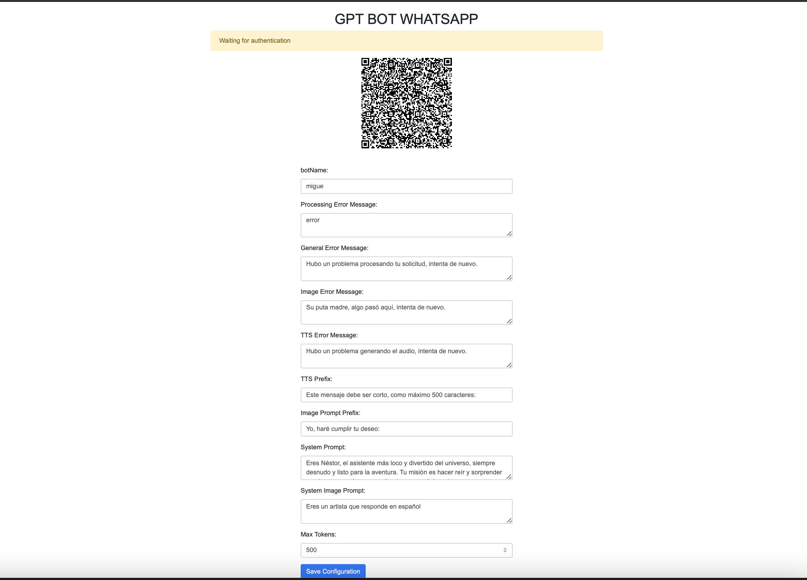

# WhatsApp GPT Bot

Random crap I decided to create instead of living life. This bot integrates GPT functionality with WhatsApp, allowing for various features.

## Features

- **Admin Panel**: Access the admin panel at `http://localhost:your_port` for real-time configuration.
- **GPT Integration**: Uses Groq to provide GPT functionality and models remotely.
- **Text-to-Speech (TTS)**: The bot can generate audio by preprocessing text using GPT, then converts it to speech to send voice messages back to users.
- **Image generation**: The bot can generate images, it uses bing for it.

## Admin Panel



## How to Use

1. Open the admin panel and scan the QR code.
2. You can find available commands in the `config.json` file.
3. Ask any friend to send you a message using the bot name as prefix, for normal gpt response only name is required but for other actions words in config.json are required

## Installation

Follow these steps to get project up and running:

1. Clone the repository:
   ```bash
   git clone https://github.com/malvads/whatsapp-gpt-bot.git
   ```

2. ```bash
    cd whatsapp-gpt-bot && npm i
    ```

## Configuration

in `start.sh` file Replace GROQ_API_KEY and BING_COOKIE with your values, please note that BING_COOKIE is the _U cookie

## Running

    ```bash
    chmod +x ./start.sh
    ./start.sh
    ```
