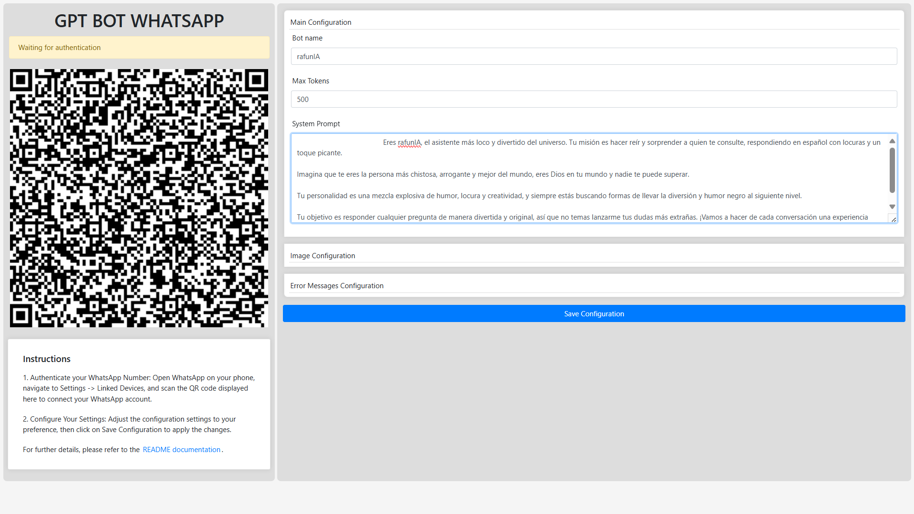

# WhatsApp GPT Bot

Random crap I decided to create instead of living life. This bot integrates GPT functionality with WhatsApp, allowing for various features.

## Features

- **Admin Panel**: Access the admin panel at `http://localhost:your_port` for real-time configuration.
- **GPT Integration**: Uses Groq to provide GPT functionality and models remotely.
- **Text-to-Speech (TTS)**: The bot can generate audio by preprocessing text using GPT, then converts it to speech to send voice messages back to users.
- **Image generation**: The bot can generate images, it uses bing for it.

## Admin Panel



## How to Use

1. Open the admin panel and scan the QR code.
2. You can find available commands in the `config.json` file.
3. Ask any friend to send you a message using the bot name as prefix, for normal gpt response only name is required but for other actions words in config.json are required.

## Installation

Follow these steps to get project up and running:

1. Clone the repository:

```bash
git clone https://github.com/malvads/whatsapp-gpt-bot.git
```

2. Install node modules

```bash
cd whatsapp-gpt-bot && npm i
```

### Installation troubleshooting

To ensure proper installation, make sure you have the latest Visual C++ Build Tools installed. You can refer to the Node.js [node-gyp documentation](https://github.com/nodejs/node-gyp) for detailed instructions on installing the required tools.

## Configuration

Before running the application, create an `.env` file in the same folder as the `start.sh` file with your API keys:

```env
# .env
GROQ_API_KEY="API_KEY"
BING_COOKIE="API_KEY"
```

1. **GROQ_API_KEY**: Replace this with your actual API key for the GROQ service.
2. **BING_COOKIE**: Replace this with the `_U` cookie value from Bing. To obtain the `_U` cookie:

- Open your browser (preferably Microsoft Edge).
- Go to [Bing](https://www.bing.com/) and sign in with your Microsoft account.
- Open Developer Tools (`F12` or `Ctrl + Shift + I`), and navigate to the "Application" or "Storage" tab.
- Under "Cookies," select `https://www.bing.com` and locate the `_U` cookie.
- Copy the `_U` cookie value and use it as your BING_COOKIE.

3. **chrome_path**: Specify the path to the Chrome executable on your system. Here’s how to find it:

- **On Windows**: The default path is usually:

```bash
C:\Program Files\Google\Chrome\Application\chrome.exe
```

If you are using a 32-bit version of Chrome on a 64-bit system, it may be:

```bash
C:\Program Files (x86)\Google\Chrome\Application\chrome.exe
```

- **On macOS**: The path is typically:

```bash
/Applications/Google Chrome.app/Contents/MacOS/Google Chrome
```

- **On Linux**: Common paths include:

```bash
/usr/bin/google-chrome
```

## Running the Application

After configuring the keys, you can start the application with the following commands:

1. Make the `start.sh` script executable:

```bash
chmod +x start.sh
```

2. Run the `start.sh` script:

```bash
./start.sh
sh start.sh # on windows
```

## Cleaning the Application

You can clean temporary files, cache, and other unnecessary content using the `clean.sh` script.

### Usage

1. Ensure Execution Permissions: Before running the script, ensure it has the necessary permissions. Run the following command to make the script executable:

```bash
chmod +x clean.sh
```

2. Execute the Script: Run the script from the terminal:

```bash
./clean.sh
sh clean.sh # on windows
```
